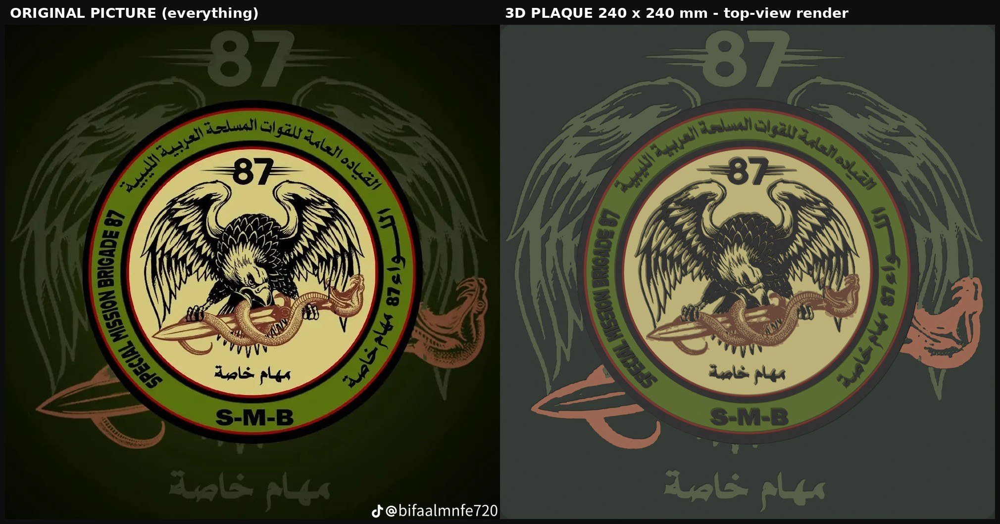

# لوحة اللواء 87 مهام خاصة (S-M-B) — جاهزة للطباعة ثلاثية الأبعاد

نسختان من اللوحة، كلتاهما تتسع في سرير 250×250 مم:

| النسخة | الحجم | ماذا فيها |
|---|---|---|
| **كاملة** `full` (الافتراضية) | مربع 240×240×4.8 مم بزوايا مدوّرة | **كل ما في الصورة**: الشعار الدائري + الخلفية الباهتة (الجناحان بكل ريشهما، رقم 87 الكبير بخطوط السرعة، الخنجر وذيل الثعبان، رأس الثعبان النحاسي، النص الباهت «مهام خاصة») + شعار تيك توك واسم الحساب (اختياري، معطّل افتراضيًا) |
| **دائرية** `round` | قرص قطره 238×4.8 مم | الشعار الدائري فقط، بحجم أكبر (تفاصيله أسهل للطباعة) |



## الملف الذي تضعه في Blender

`blender/build_sultan_plaque.py` — ويجب أن يبقى بجانبه الملفان `sultan_full_layers.npz` و`sultan_emblem_layers.npz`.

1. حمّل مجلد `blender/` كاملًا على جهازك.
2. في Blender: تبويب **Scripting** ← **Text ← Open** ← اختر `build_sultan_plaque.py` ← اضغط **Run Script** (أو Alt+P).
   **لا تلصق الكود** في نص جديد، فبحث الملفات يعتمد على مكان الملف المفتوح (وإن لصقتَه تظهر رسالة تذكر المجلدات التي بُحث فيها).
3. انتظر 10–20 ثانية (يظهر التقدم في الشريط السفلي ثم نافذة صغيرة بالنتيجة). يظهر المجسّم في المشهد بالأجزاء الملوّنة، وتُحفظ ملفات الطباعة في `SMB87_output/` بجانب السكربت.
4. غيّر الإعدادات من أعلى السكربت ثم شغّله من جديد (يستبدل النتيجة السابقة ولا يكرّرها):

```python
LAYOUT = "full"                  # "full" الصورة كلها  |  "round" الشعار الدائري فقط
PLAQUE_SIZE = {"full": 240.0, "round": 238.0}    # مم
INCLUDE_WATERMARK = False        # True = اطبع أيضًا شعار تيك توك واسم الحساب @bifaalmnfe720
BASE_THICKNESS = 3.6             # سمك القاعدة السوداء
RELIEF = {"black": 1.2, "red": 0.8, "green": 0.4, "cream": 0.4, "tan": 0.6, "brown": 0.8,
          "plate": 0.4, "ghost": 0.8, "copper": 0.8, "mark": 0.8}   # ارتفاع كل لون فوق القاعدة (مم)
HANGERS = True                   # فتحتا تعليق على الظهر
```

السكربت يتحقق في كل تشغيل أن المجسّم **مغلق (watertight)** وأن مجموع الأجزاء = القطعة الكاملة، ويعيد قراءة ملف STL المكتوب ويدمج رؤوسه كما يفعل الـ slicer ليتأكد مرة أخرى؛ وإن فشل أي فحص يتوقف دون كتابة ملف معطوب.

## ملفات الطباعة الجاهزة (`print/`)

| الملف | الاستخدام |
|---|---|
| `full_240mm_everything/SMB87_full_240mm_merged.stl` | **الطباعة بلون واحد** — قطعة واحدة مغلقة |
| `full_240mm_everything/SMB87_full_parts_stl.zip` | **الطباعة الملونة** — 9 أجزاء STL منفصلة |
| `full_240mm_everything/SMB87_full_240mm_parts.3mf` | نفس الأجزاء في ملف 3MF واحد |
| `round_238mm_emblem_only/…` | النظائر للنسخة الدائرية (6 أجزاء) |

**في Anycubic Slicer Next:** الطباعة بلون واحد: حمّل ملف `merged.stl` كما هو (الظهر على السرير والبروز لأعلى، بلا دعامات).
الطباعة الملونة: حمّل ملفات الأجزاء STL **معًا**، واختر «نعم» عند السؤال عن تحميلها كجسم واحد متعدد الأجزاء، ثم عيّن الفيلامنت لكل جزء من **Object List** (هذه هي الطريقة الموثّقة في [دليل Anycubic](https://wiki.anycubic.com/en/software-and-app/anycubicslicer/3dphotosliceguide)). جرّب 3MF إن أحببت، لكن تحقق من Object List بعد التحميل لأن بعض الـ slicers تفقد الأجزاء/الألوان من 3MF القادمة من برامج أخرى. مع ACE Pro (4 ألوان) ادمج: أسود / أخضر+الأرضية الداكنة / بيج+tan / أحمر+بني+نحاسي، وعيّن الفيلامنت نفسه لعدة أجزاء.

| الجزء | يشمل | اللون | الارتفاع |
|---|---|---|---|
| black | القاعدة، الحلقتان السوداوان، خطوط النسر، كل الحروف | `#0E0E0E` | 1.2 مم |
| red | الحلقتان الحمراوان | `#7D1908` | 0.8 |
| green | الحزام الأخضر | `#59710E` | 0.4 |
| cream | القرص البيج | `#D0C481` | 0.4 |
| tan | جسم الثعبان ونصل الخنجر | `#A88A5C` | 0.6 |
| brown | حراشف الثعبان وظل الخنجر | `#6E3E24` | 0.8 |
| plate (full) | الأرضية الداكنة خلف الشعار | `#18261A` | 0.4 |
| ghost (full) | الأجنحة و87 الكبير والنص الباهت | `#546040` | 0.8 |
| copper (full) | الخنجر الباهت وذيل ورأس الثعبان | `#AA6A4E` | 0.8 |
| mark (full، اختياري) | تيك توك واسم الحساب | `#F5F5F5` | 0.8 |

إعدادات مقترحة لـ Kobra 3 (نقطة بداية وليست قيمًا مُجرَّبة): PLA، فوهة 0.4، طبقة 0.2 (كل الارتفاعات مضاعفات 0.2)، جدران 3، تعبئة 20% gyroid، الجدار الخارجي 40–60 مم/ث، بلا brim وskirt لفة واحدة، سرير PEI نظيف 55–60°. وزن المجسّم لو طُبع صلبًا: النسخة الكاملة ≈ 297 جم، الدائرية ≈ 237 جم، ويقلّ كثيرًا بالتعبئة 20%.

## ما تم التحقق منه
- **المجسّمات**: المدمج والأجزاء كلها مغلقة (trimesh + manifold3d)، قطعة واحدة، بلا مثلثات متحلّلة؛ أبعاد النسخة الكاملة 240.000×240.000×4.800 مم والدائرية 238.000×238.000×4.800 مم؛ مجموع حجوم الأجزاء = حجم القطعة المدمجة بفرق 0.000 (لا فجوات ولا تداخل). بعد إعادة قراءة STL ودمج رؤوسه ما زال مغلقًا.
- **Blender**: يعمل من Run Script (مشروع غير محفوظ / محفوظ في مكان آخر / بجانب السكربت)، ويستبدل النتيجة عند إعادة التشغيل دون تكرار، وصُحّح خلل كان يمنع إيجاد ملف البيانات عند التشغيل من الواجهة. جُرّب على **Blender 5.0.1**، وجرّبه مراجع مستقل على الإصدار 4.2 LTS (نسخة سابقة من السكربت)؛ **لم يُجرَّب على 3.6**.
- **تحويل الصورة**: استعادة حدة متماثلة تحفظ سُمك الخطوط الحقيقي، وحواف الفن الباهت بدقة؛ يغطي النموذج 99% من بكسلات الفن الباهت الواضحة بلا إيجابيات كاذبة، وأكثر من 98.7% من بكسلات الحبر الأسود الواضحة في الشعار.
- 12 تركيبة عشوائية من الإعدادات (التخطيطان، علامة تيك توك، ارتفاعات، أحجام 150–240 مم، 0–3 فتحات تعليق) والمجسّم مغلق في كلها.
- مسار `tools/run_pipeline.py` يعيد إنتاج ملفي البيانات من الصورة الأصلية.

## حدود يجب أن تعرفها
- **لم أطبع اللوحة فعليًا**؛ التحقق رقمي. جرّب قطعة صغيرة أولًا (مثلًا `PLAQUE_SIZE = {"full": 120, "round": 120}`) قبل الطباعة الكاملة.
- افترضتُ طابعة **Anycubic Kobra 3** (سرير 250×250×260 مم؛ [المواصفات](https://printer-hub.ru/en/posts/anycubic-kobra-3-best-mods)). اللوحة المربعة 240 مم تترك 5 مم من كل جانب؛ تأكد من معاينة الـ slicer أنها داخل منطقة الطباعة وأن خط التنظيف (prime line) لا يصطدم بها.
- في النسخة الكاملة يصغر الشعار إلى 166 مم، فتزيد الخطوط الأدق من الفوهة: 1.3% من مساحة خطوط النسر والحروف السوداء أرق من 0.4 مم (0.2% في النسخة الدائرية)، أما شرائح لون tan الرقيقة في جسم الثعبان فنحو 29% منها أرق من 0.4 مم في الكاملة (15% في الدائرية) وقد لا تظهر بوضوح. لأدق نتيجة استعمل فوهة 0.2 مم، أو اطبع النسخة الدائرية (الشعار 238 مم).
- الصورة المصدر 1080×1080؛ ما هو أدق من بكسلها (≈0.23 مم في النسخة الكاملة) غير موجود في الصورة أصلًا. أرسل الشعار بدقة أعلى لنتيجة أدق.
- ألوان صور المعاينة تقريبية بسبب الإضاءة.
- لم أستطع تجربة تحميل الـ 3MF داخل Anycubic Slicer Next نفسه، فاعتمد على ملفات STL للطباعة الملونة.
