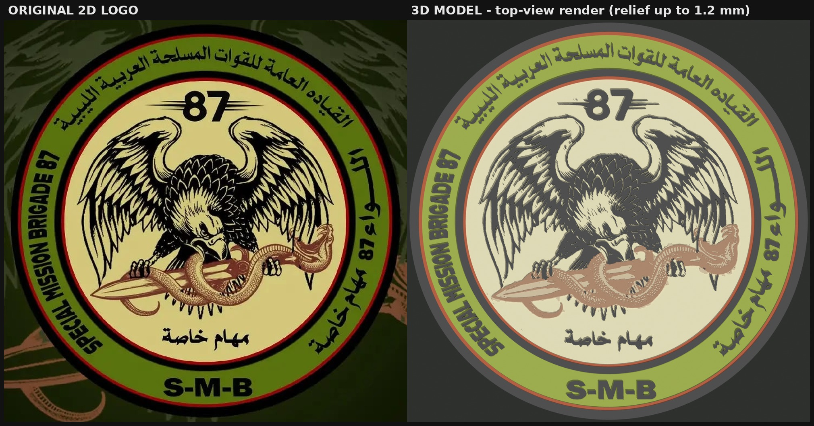

# لوحة اللواء 87 مهام خاصة (S-M-B) — مجسّم جاهز للطباعة ثلاثية الأبعاد

لوحة دائرية بقطر **238 مم** (تتسع في سرير 250×250 مم) وسُمكها **4.8 مم** كحد أقصى، بتفاصيل بارزة من الشعار الأصلي:
النسر بكل ريشه، الثعبان والخنجر، رقم 87، الكتابة العربية والإنجليزية على الحزام، والحلقات الأربع.
على الظهر فتحتا تعليق للحائط (keyhole).

## الملفات

| الملف | الاستخدام |
|---|---|
| `print/SMB87_plaque_238mm_merged.stl` | **للطباعة المباشرة بلون واحد** — قطعة واحدة مغلقة |
| `print/SMB87_plaque_238mm_6colour_parts.3mf` | للطباعة متعددة الألوان — جسم واحد من 6 أجزاء ملوّنة |
| `print/SMB87_parts_stl.zip` | نفس الأجزاء الستة كملفات STL منفصلة (إن لم يُحمَّل الـ 3MF بشكل صحيح) |
| `blender/build_sultan_plaque.py` | **الكود الذي تضعه في Blender** |
| `blender/sultan_emblem_layers.npz` | بيانات الشعار المحوَّل (يجب أن يبقى بجانب السكربت) |
| `preview/` | صور معاينة (منظور علوي، تقريب للنسر والثعبان والكتابة، مقارنة بالأصل، مخطط السرير) |
| `tools/` | مسار التحويل من الصورة 2D إلى البيانات (لإعادة الإنتاج أو لشعار آخر) |

## 1) الطباعة بدون Blender
حمّل `SMB87_plaque_238mm_merged.stl` في **Anycubic Slicer Next** (أو Cura/Orca). الاتجاه صحيح كما هو: **الظهر على السرير والبروز لأعلى**، ولا يحتاج دعامات (supports).

إعدادات مقترحة (PLA على Kobra 3، وهي نقطة بداية وليست قيمًا مُجرَّبة على طابعتك):

- فوهة 0.4 مم، ارتفاع طبقة **0.2 مم** (كل الارتفاعات في التصميم مضاعفات 0.2).
- جدران (walls) 3، علوي/سفلي 4 طبقات، تعبئة 20% (gyroid).
- سرعة الجدار الخارجي 40–60 مم/ث لتخرج حواف الريش والحروف حادة.
- بدون brim (قطر 238 مم لا يترك مجالًا)، وskirt لفة واحدة. استخدم سطح PEI نظيفًا وحرارة سرير 55–60° وتجنّب تيار الهواء لمنع التواء الحواف.
- الوزن التقريبي 110–150 جم PLA، وزمن الطباعة يُحدَّده الـ slicer (تقديري: عدة ساعات إلى حوالي 12 ساعة حسب السرعة).
- لأدق نتيجة ممكنة: فوهة **0.2 مم** وطبقة 0.1 مم (أبطأ بكثير).

**طباعة بلون واحد ثم التلوين:** الأسود البارز (خطوط النسر والحروف) أعلى من الخلفية بـ 0.8 مم، فيمكن تلوين الخلفية أو تمرير فرشاة جافة (dry-brush) على البروز لإبراز التفاصيل.

## 2) الطباعة متعددة الألوان
الأجزاء الستة وألوانها كما في الشعار:

| الجزء | يشمل | اللون المقترح | الارتفاع فوق القاعدة |
|---|---|---|---|
| black | القاعدة، الحلقتان السوداوان، خطوط النسر، كل الحروف، رقم 87 | `#0E0E0E` | 1.2 مم |
| red | الحلقتان الحمراوان الرفيعتان | `#7D1908` | 0.8 مم |
| green | الحزام الأخضر | `#59710E` | 0.4 مم |
| cream | القرص البيج | `#D0C481` | 0.4 مم |
| tan | جسم الثعبان ونصل الخنجر | `#A88A5C` | 0.6 مم |
| brown | حراشف الثعبان وظل الخنجر | `#6E3E24` | 0.8 مم |

حمّل ملف الـ 3MF (أو الأجزاء الستة معًا واختر «تحميل كجسم واحد متعدد الأجزاء») ثم عيّن فيلامنتًا لكل جزء. إن كان عندك ACE Pro بأربعة ألوان فاجمع: أسود / أخضر / بيج+tan / أحمر+بني (عيّن الفيلامنت نفسه لجزأين).

## 3) استخدام الكود داخل Blender
1. ضع `build_sultan_plaque.py` و`sultan_emblem_layers.npz` في نفس المجلد.
2. Blender ← تبويب **Scripting** ← **Open** ← اختر السكربت ← **Run Script** (Alt+P). تستغرق العملية بضع ثوانٍ إلى نصف دقيقة.
3. يظهر المجسّم في المشهد (الأجزاء ملوّنة، والقطعة المدمجة مخفية)، وتُحفظ الملفات في `SMB87_output/` بجانب السكربت.
4. غيّر الإعدادات في أعلى السكربت ثم شغّله من جديد: `PLAQUE_DIAMETER` (القطر)، `BASE_THICKNESS`، `RELIEF` (ارتفاع كل لون)، `HANGERS`، `HANGER_POSITIONS`…

جرّبتُ السكربت فعليًا على **Blender 5.0.1** فقط؛ وهو يستخدم واجهات قياسية موجودة في الإصدارات الأقدم (3.6 وما بعده) لكنني لم أختبره عليها. ويعمل أيضًا خارج Blender بـ Python + numpy. وهو يتحقق في كل تشغيل أن المجسّم مغلق (watertight) ويطبع التقرير.

## ما تم التحقق منه (رقميًا)
- الملف المدمج: **مغلق وسليم** (0 حافة معيبة، قطعة واحدة)، الأبعاد 238.000 × 238.000 × 4.800 مم، الحجم 190.9 سم³.
- الأجزاء الستة مغلقة، ومجموع حجمها = حجم القطعة المدمجة (فرق 0.000) أي لا فجوات ولا تداخل.
- مقاطع القص عند كل ارتفاع مغلقة؛ ومساحة مقطع الأسود تطابق مساحة الأسود المحسوبة.
- اختبرت تغيير الإعدادات: 9 تركيبات (ارتفاعات عشوائية، أقطار 180–240 مم، 0–3 فتحات تعليق) والمجسّم يبقى مغلقًا في كلها.
- أكثر من 99% من مساحة خطوط النسر والحروف أعرض من 0.4 مم (قابلة للطباعة بفوهة 0.4)، والفراغات بين الخطوط كذلك. نحو 48 نقطة صغيرة جدًا (أقل من 0.3 مم) من أصل 279 جزءًا أسود قد لا تظهر، ومساحتها لا تُذكر.
- إعادة تشغيل `tools/run_pipeline.py` من الصورة الأصلية تُنتج نفس ملف البيانات تمامًا.

## حدود يجب أن تعرفها
- **لم أطبع اللوحة فعليًا**؛ التحقق رقمي (إعادة تحميل الملفات بمكتبة مستقلة، مقاطع قص، مقارنة بالأصل). جرّب أولًا بقطر أصغر (مثلًا `PLAQUE_DIAMETER = 120`) قبل طباعة 238 مم.
- افترضتُ طابعة **Anycubic Kobra 3** (سرير 250×250×260). لو طابعتك مختلفة أخبرني، أو غيّر `PLAQUE_DIAMETER` و`BED_XY`.
- الصورة المصدر 1080×1080 والشعار فيها حوالي 720 بكسل، أي نحو 0.33 مم لكل بكسل عند 238 مم. التفاصيل الأدق من ذلك غير موجودة في الصورة أصلًا؛ للحصول على دقة أعلى أرسل الشعار بدقة أكبر (PNG أو SVG).
- **لم أُدخل** خلفية الصورة (الأجنحة الباهتة وعلامة تيك توك `@bifaalmnfe720`) لأنها ليست جزءًا من الشعار. إن أردتها كنقش خفيف خلف الشعار أخبرني.
- ألوان معاينة الصور تقريبية بسبب الإضاءة؛ الألوان الحقيقية هي ألوان الفيلامنت الذي تختاره.
- لم أستطع تجربة تحميل الـ 3MF داخل Anycubic Slicer Next نفسه. إن ظهر كأجزاء منفصلة أو فارغًا فاستخدم ملفات STL المنفصلة.
